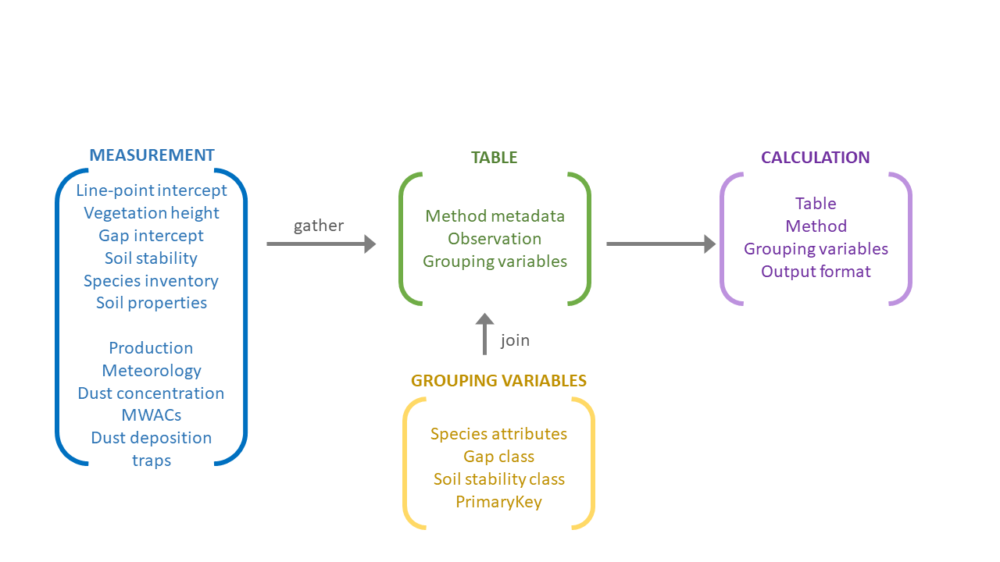
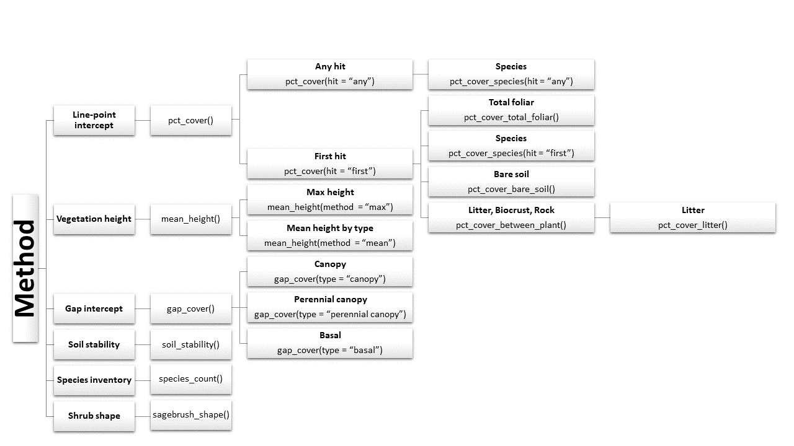

<!-- README.md is generated from README.Rmd. Please edit that file -->

```{r, include = FALSE}
knitr::opts_chunk$set(
  collapse = TRUE,
  comment = "#>",
  fig.path = "man/figures/README-",
  out.width = "100%"
)
```
# terradactyl 

<!-- badges: start -->
[](https://zenodo.org/badge/latestdoi/108332745)
<!-- badges: end -->

The goal of terradactyl is to provide tools for tidying rangeland core methods monitoring data and to produce standard indicators from those data. 

## Installation

``` r
devtools::install_github('Landscape-Data-Commons/terradactyl')
```

## Example

This is a basic example which shows you how to solve a common problem:

```{r example}
library(terradactyl)
## basic example code
```




